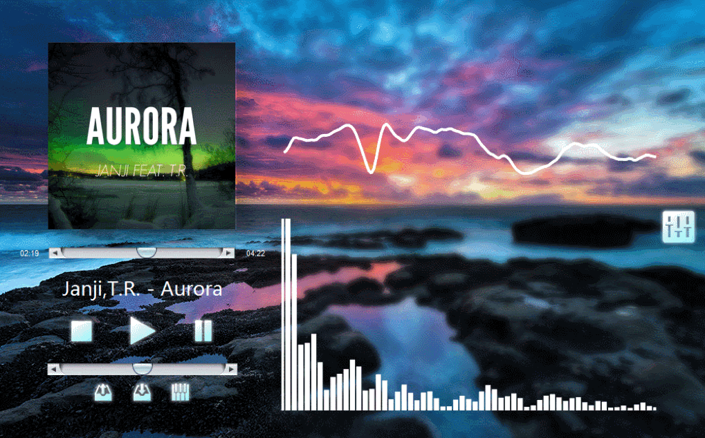
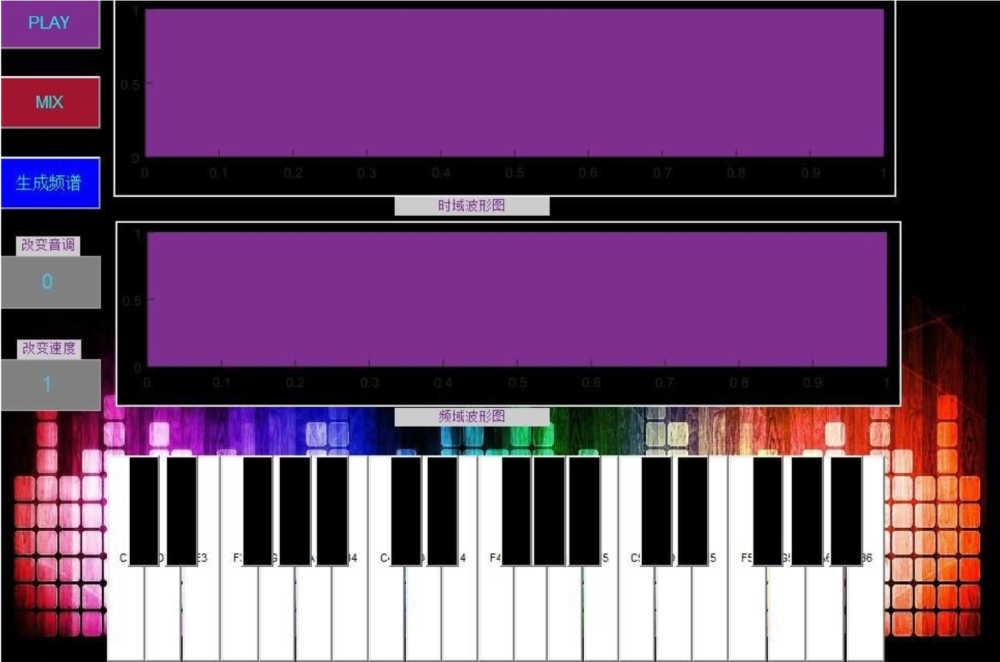
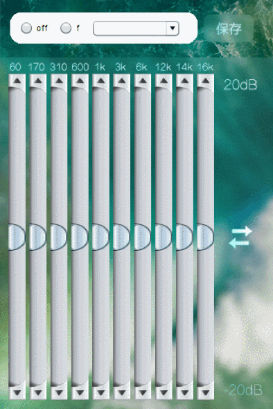

## matlab music player
https://github.com/Dedsec-Xu/Matlab_music

A simple MATLAB music player with multiple functions: Piano mode, equalizer, spectrum, wave visualizer. I developed it using MATLAB.

